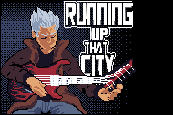

<!---
Caso o jogo tenha uma logo, disponibilizá-la no README
--->

  

## 📃 Sobre o jogo
<!---
Aqui faça uma descrição breve para os jogadores sobre o seu jogo! Qual o gênero? É multijogador? etc...
--->

**Running Up that City** é um jogo single player do gênero plataforma. Você controla o super astro do rock que encontra-se em uma situação adversa e se vê obrigado a fugir de uma de suas fãs malucas enquanto supera os obstaculos da cidade.

### Tutorial

## 🎮 Engine & linguagens
<!---
Aqui recomenda-se que sejam colocados os ícones da game engine e das linguagens de programação que foram utilizadas no desenvolvimento do seu jogo, como o exemplo à seguir
--->

## 🧠 Desenvolvedores
<!---
Aqui sugere-se que sejam colocados ao menos os nomes de cada desenvolvedor envolvido na criação do seu jogo
--->

- [Amós Ribeiro](https://github.com/amosribeiroc)
- [Arthur Taylor](https://github.com/Eruel6)
- [Víctor Moreira](https://github.com/aqela-batata-alt)
- [Iuri Severo](https://github.com/iurisevero)
